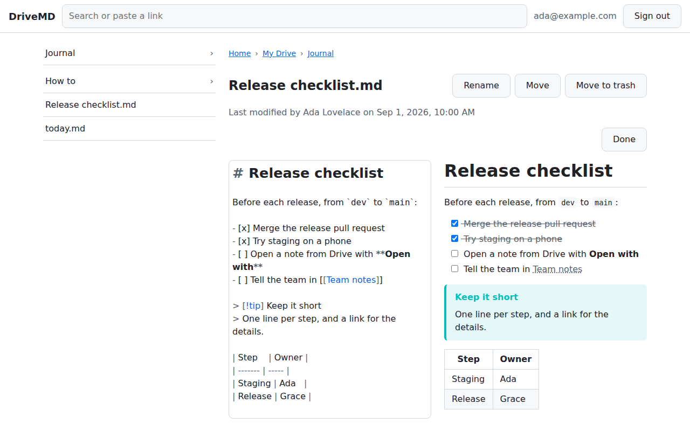

# DriveMD

Browse, view and edit the Markdown files in Google Drive, on desktop and on phones (iPhone first, Android too), including notes in Obsidian vaults.



DriveMD is a static web app for a Google Workspace organization. It signs in with Google, calls the Drive API straight from the browser, with no server of its own, and never rewrites a file it did not change. Edgeweave builds it in the open and runs it for its own organization; another organization runs its own copy, as [Running your own](#running-your-own) explains.

## Status

Milestones 1 to 7 are done, and milestone 8, mobile polish, comes next. The product spec, [`docs/SPEC.md`](docs/SPEC.md), is the source of truth, and its build plan drives the work one milestone at a time.

- **Milestone 1, sign-in.** The app signs in with Google and shows the signed-in account's email, CI deploys `dev` to staging, and sign-in passed the test on a real iPhone without a token backend.
- **Milestone 2, the Drive client.** `src/drive.ts` is the typed Drive client that the next milestones build on, tested against mocked Drive answers.
- **Milestone 3, the file navigator**, checked on the real Drive in real browsers and on a real iPhone. Once signed in, the app opens on Home, which shows the Markdown files opened last and the Obsidian vaults in Drive, and from which My Drive, Shortcuts, Shared drives and Shared with me open, then their folders one after the other, listing their folders and Markdown files and following shortcuts, and greying out those whose target is gone. Breadcrumbs show the path taken, or the one rebuilt from Drive for a page opened by its address, and a search box on every page finds Markdown files by name in every drive, saying when Drive left some drives out. **New** creates a Markdown file in a folder where the user may add files, asking for its name first, and a file's page can rename it or move it to another folder, warning first when it sits in an Obsidian vault, or move it to Drive's trash once the user confirms. On a wide screen, a file's page lists its folder beside it; on a tablet held upright, **Folder** opens that list in a drawer. Each page has its own address (see the spec's file navigator).
- **Milestone 4, the viewer and editor**, checked on the real Drive in real browsers and on a real iPhone: saving a note changes only the lines edited, a file with Windows line breaks or a byte order mark is written back byte for byte, and a file that is not UTF-8 opens read-only. A file opens on its own page, which says who changed it last and shows it rendered as GitHub renders Markdown, with tables, task lists, footnotes, highlighted code, sanitized HTML and front matter as a table of properties; a file over 1 MB, or one the user may not download, leads to Google Drive instead, and a badge says why a file is read-only. Relative links lead where their path does in Drive, from the note's folder: to a note or a folder in the app, to another file in Google Drive, and a link to nothing is faded. Relative images show from Drive, up to 10 MB; images on other sites are not loaded: each is a link that opens it in a new tab. **Edit** opens the note's source in CodeMirror, beside the preview on a wide screen or a tablet and in its place on a phone, with Markdown highlighting and front matter as YAML, lists continued on Enter, a search panel, and Cmd/Ctrl+click to follow a link. A tap on a task's checkbox, in the viewer or the preview, checks or unchecks it, and **Save**, or Cmd/Ctrl+S, writes the note back: only if its bytes changed, once Drive confirms nobody else changed it since (when someone did, the page shows the differences and lets the user keep Drive's version, overwrite it, or save theirs as a copy), and keeping the revision from before the first edit in the file's version history. Unsaved changes are kept on the device as the user types, and reopening the note offers them back; Home lists the notes that have some first, and lets the user discard those of a note that no longer opens. Leaving a note with unsaved changes asks first.
- **Milestone 5, Obsidian vaults**, checked on the real Drive in real browsers, and compared with Obsidian's reading view on a real iPhone, on a made-up test vault. A link to a note's heading, `plan.md#next-steps`, opens the note there. A note in an Obsidian vault shows as Obsidian shows it: a single line break shows as one, unless the vault's settings join lines as Markdown does, callouts show in their type's color, folded or open when they fold, highlights, tags and inline footnotes show, checked tasks are struck through, and comments and block IDs do not. Internal links, `[[Note]]` and Markdown links alike, lead where Obsidian's do: a name anywhere in the vault, nearest first, at the heading or block they name. Embedded images, `![[image.png|300]]`, show from Drive at the size they give, embedded notes show inline, the section or block they name, three deep at most, and other embeds are links.
- **Milestone 6, routing and links**, checked on the real Drive in real browsers, and Drive's New page on a real iPhone: each address opens the right file after sign-in. A file's `/edit?id=…` opens it, with its resource key, and so does a Drive link pasted in the search box, to a file or a folder. Drive's **Open with** address, `/open?state=…`, gives way to the file's own once the app starts, and the tab has the user pick the account to sign in with, starting from the one Drive used. Drive's **New**, `/new?state=…`, asks for the new note's name, saying which folder Drive named, creates it there and opens it. Drive itself sends these addresses once the app is listed, at milestone 7.
- **Milestone 7, Drive integration and production**, checked in Drive on the web, on a computer and on an iPhone. Production, https://md.corp.edgeweave.tech, is deployed by CI from `main`, beside staging. DriveMD has a private Google Workspace Marketplace listing, installed for the organization: **Open with** on a .md file in Drive on the web, in a computer's or a phone's browser, opens it in DriveMD, after a sign-in through Google's account chooser, and so does a double click once DriveMD is the user's default app for it. Drive's own **New** does not offer DriveMD, since Drive now creates Markdown files itself and opens them in Google Docs, and Drive's phone apps do not open web apps. The sign-in screen links to `/about.html`, the privacy, terms and support page that the listing links to, and the browser tab shows DriveMD's icon.

## Signing in

**Sign in with Google** opens Google's window, so the browser must allow pop-ups for the site. The session then lasts about an hour for the tab: a reload keeps it, while a new tab or a relaunch of the Home Screen app asks for **Continue**, which renews it for the account remembered on the device, usually with a window that closes by itself. Once the hour is up, the next tap that opens a page renews the session in the same way, and a page that loads without a tap asks for **Continue**. A tab that Drive's **Open with** or **New** opens asks to **Sign in** rather than **Continue**, with Google's account chooser starting from the account Drive used, and the account picked becomes the one remembered on the device. **Sign out** forgets the session on the device, in every open tab, without revoking DriveMD's access to the Google account. It also discards the unsaved changes kept on the device for the account, after saying how many notes have some.

The sign-in screen links to `/about.html`, which says what DriveMD does with your data, its terms of use, where to report a problem and where its source code is, without signing in.

## On a phone

On an iPhone, Safari's **Share > Add to Home Screen** puts DriveMD on the Home Screen, with its icon; on Android, Chrome offers **Install app** (or **Add to Home screen**). DriveMD then opens on Home, in a window of its own, from whatever page of the app it was added. Once installed on Android, DriveMD is offered in the share sheet: a shared link to a Drive file or folder, or to a page of DriveMD, opens there, even with words around it. Its web app manifest is `public/manifest.webmanifest`; its icons are `public/icon.svg` and, for launchers that round or cut icons to their own shape, `public/icon-maskable.svg`, rendered as PNG files beside them.

## Editing on a touch screen

On a phone or a tablet, a row of keys sits above the keyboard while the note's source has the focus: **Undo**, **Redo**, **Heading** (`#`, `##`, `###`, then text again), **Bold**, **List**, **Checkbox** (an open task, a done one, then a plain list item again), **Link**, **Indent** and **Outdent** (one level of a list, lined up with the text of the item above, with tabs where the list already uses tabs, as Obsidian's do; a numbered item that starts a new nested list becomes `1.`, the only character other than spaces and tabs they change, since Markdown nests no list that starts at another number, and Undo brings its number back; an item nests in the preview once it has text; the iPhone keyboard has no Tab key, and Cmd/Ctrl+] and Cmd/Ctrl+[ do the same on a computer), and **Find in note**. The row scrolls sideways when it does not fit, and its keys keep the keyboard up. With a mouse, the row does not show.

## Stack

Vite, React and TypeScript; Google Identity Services and the Drive REST API v3, with TanStack Query caching Drive's answers; CodeMirror 6 for editing and react-markdown for rendering; Firebase Hosting. The spec explains each choice.

## Running your own

DriveMD serves one Google Workspace organization. It asks for Google's `drive` scope, to edit files that other tools made: an app whose audience is **Internal**, the organization's own accounts, may use that restricted scope without Google's verification, while one open to other accounts must pass it, a security assessment included. Each organization therefore runs its own copy, from a Google Cloud project of its own.

1. In a Google Cloud project of your organization, enable the Google Drive API, set the audience to **Internal** in Google Auth Platform, and create an OAuth client of type **Web application** whose authorized JavaScript origins are your app's addresses, and `http://localhost:5173` for development. The spec's [Google Cloud setup](docs/SPEC.md#google-auth-scopes-and-workspace-setup) gives each step, with Edgeweave's addresses.
2. Rewrite `about.html`, which speaks for Edgeweave, with your own description, privacy policy, terms and support, and point its source code link at your copy's source: the AGPL asks whoever serves a modified version to its users to offer them its source. `e2e/about.e2e.ts` checks the page's links.
3. Build with your client's ID, `VITE_GOOGLE_CLIENT_ID=<client-id> npm run build`, and serve `dist/` over HTTPS. Firebase Hosting serves it as `firebase.json` says, and [Deployment](#deployment) has CI deploy it. Another host must send the same headers, the Content Security Policy above all, which keeps script in a note from reaching the user's token, and serve the files of `dist/` as they are and `index.html` for any other path.
4. To open .md files from Drive's **Open with**, list the app as the spec's [Drive integration](docs/SPEC.md#drive-open-with-integration-via-private-marketplace) section does, with your own addresses.

## Development

You need Node.js 22.22.2 or later on the 22 line (`.nvmrc`), or 24.15.0 or later on the 24 line, and npm.

```sh
npm ci
npm run dev
```

Open http://localhost:5173, not `127.0.0.1`: it is the only local origin the OAuth client authorizes, so the dev server refuses to start on another port. Signing in needs an OAuth client's ID (see Configuration), but the tests do not: they replace Google with made-up answers.

| Command                    | What it does                                                    |
| -------------------------- | --------------------------------------------------------------- |
| `npm run dev`              | Serve the app with hot reload                                   |
| `npm run build`            | Type-check, then build the static site into `dist/`             |
| `npm run preview`          | Serve the `dist/` build on the same port                        |
| `npm test`                 | Run the tests in watch mode                                     |
| `npm run coverage`         | Run the tests once; fails under the coverage thresholds         |
| `npm run e2e`              | Run the end-to-end tests in real browsers                       |
| `npm run lint`             | Lint with type-aware and security rules; any warning fails      |
| `npm run format`           | Format every file with Prettier (`npm run format:check` checks) |
| `npm run deploy`           | Deploy `dist/` to the site mapped to the `app` target           |
| `npm run live-check:login` | Sign the test account in for the live Drive checks              |
| `npm run live-check`       | Check the Drive client against the real Drive                   |
| `npm run live-check:ui`    | Check the deployed app on the real Drive, in real browsers      |

Write the failing test first, then the code that makes it pass. CI runs the checks above on every pull request and on every push to `dev` and `main`.

## End-to-end tests

`npm run e2e` builds the app and serves it with the headers Firebase Hosting sends, its security policy included. It then drives the app with Playwright in Chromium, as a desktop, and in WebKit, as an iPad and an iPhone held upright and sideways. Google's sign-in script and the Drive API are replaced by made-up ones (`e2e/fake-google.ts`), so the tests need no account and never reach Google. A test fails on any page error and on anything the security policy blocks.

Before the first run, download the browsers once with `npx playwright install chromium webkit`: they go to `~/.cache/ms-playwright`, shared by every project on the machine. WebKit also needs system libraries, which `sudo npx playwright install-deps webkit` installs. CI installs both on every run, and CI deploys only once the tests pass. The tests record no traces, screenshots or videos, which would keep the requests the app makes.

## Configuration

The app reads its settings from `VITE_*` environment variables when it is built. For development, copy `.env.example` to `.env.local` and fill it in; git ignores `.env` and `.env.local`.

| Variable                | Value                                                                                                                                |
| ----------------------- | ------------------------------------------------------------------------------------------------------------------------------------ |
| `VITE_GOOGLE_CLIENT_ID` | ID of the OAuth client of type Web application, from [Running your own](#running-your-own); sign-in stays disabled while it is empty |

## Live Drive checks

The unit tests replace Google Drive with mocked answers, so a few behaviors can only be checked against the real Drive. The live checks do it as a test account of your organization, never with a person's account: its Drive holds nothing but what the checks create, a made-up file `drivemd-live-view-only.md` that another account shares with it as a viewer, and a shared drive named `DriveMD live check` where it is a content manager, holding a made-up file `drivemd-live-from-another.md` that another member added. Nothing about the account enters the repository. Its credentials stay in `~/.config/drivemd-live/`, or in the absolute path set in `DRIVEMD_LIVE_DIR`: the desktop OAuth client as `client.json` and the account's grant as `grant.json`. The scripts read them only when they are yours and nobody else can read them, and check with Drive that the grant belongs to the account it names before they act.

To set up, once:

1. Create an OAuth client of type **Desktop app** in the Google Cloud project, download its JSON, and save it as `client.json` in that folder, then `chmod 700` the folder and `chmod 600` the file.
2. In your own terminal, since it asks you to paste an address, run `DRIVEMD_LIVE_ACCOUNT=<test account> npm run live-check:login`. Open the address it prints, sign in as the test account and allow access; the browser then fails to load `127.0.0.1`, and you paste its address back. The script keeps the grant only if the test account signed in, and revokes any grant it cannot keep or that it replaces; it saves the grant as `grant.json`, readable only by you.

Then `npm run live-check` runs the checks, which CI never does. Among them, notes written as another tool would, with CRLF and a byte order mark, LF or CR line breaks, are opened, decoded and saved with one task checked, and Drive must then hold the same bytes but that one; a note that is not UTF-8 must open read-only, and a save over someone else's change must write nothing. A file must also be found by its exact name, whatever its case, as Obsidian's links find notes, accented names included; and Drive must name no folder of a file shared alone that the account cannot reach. They make what they need in a folder of their own in the test account's Drive and trash it at the end, and they compare IDs rather than listings, so that no failure prints the names of other files. A check that needs one of the made-up files or the shared drive is skipped until it exists.

`npm run live-check:ui` checks the deployed app the same way, in Chromium as a desktop and WebKit as an iPhone: staging by default, or the address in `DRIVEMD_LIVE_URL`. It hands the page the test account's session as a sign-in would leave it, so Google's window never opens; it then reaches notes in My Drive, a shared drive, a vault and behind a shortcut, finds one on Home and by search, and creates, renames, moves and trashes one, in a folder of its own that it trashes at the end. It also checks a task and edits a note's source in the deployed app, and finds Drive holding the bytes it should. It opens a note from Drive's **Open with** address and a folder from a Drive link pasted in the search box, and creates a note from Drive's **New** address in the folder it names. Last, it opens a note of a vault written as Obsidian would, with a callout, a highlight, a tag, a comment, a link and embeds of a note's section and a picture, which must show and lead to the files they name. It fails on any page error and on anything the security policy blocks that the app depends on. It records no traces, screenshots or videos, which would keep the token.

## Security

The app's access token can read and write the user's whole Drive, so the repository guards against injected code and a compromised supply chain:

- Strict TypeScript and type-aware ESLint, whose rules reject `eval` and unsanitized DOM sinks such as `innerHTML` and `dangerouslySetInnerHTML`.
- The Drive client sends the token only in the `Authorization` header, refuses an ID that is not shaped like a Drive ID before it reaches a URL or a query, escapes search text, and keeps Drive's answers out of the browser's HTTP cache.
- `firebase.json` serves a strict Content Security Policy that enforces Trusted Types and allows no images but the app's own and the object URLs it makes for images read from Drive, nor any inline style: the editor styles itself in a shadow root, through constructed style sheets, along with HSTS, isolation from other origins' windows and requests, and no MIME sniffing. `src/security-headers.test.ts` fails if any of them weakens.
- `.npmrc` saves exact versions in `package.json`, turns off dependency install scripts and refuses Node.js versions outside `engines`. After adding a dependency, check that it works without its install script.
- CI installs from the lockfile with `npm ci`, verifies registry signatures, blocks malware and critical advisories in any dependency, and blocks any advisory in the dependencies that ship.
- Dependabot proposes npm and GitHub Actions updates weekly, for releases at least 7 days old.
- Workflows pin every action to a commit SHA, start from no permissions and grant each job only what it needs; zizmor audits them in CI, and gitleaks scans the full history on every push and every pull request from a fork. The zizmor and gitleaks versions are pinned in the workflows and bumped by hand.

## Contributing

[`CONTRIBUTING.md`](CONTRIBUTING.md) says how to propose a change, and [`SECURITY.md`](SECURITY.md) how to report a vulnerability, privately. Issues and pull requests are public: leave out real file names, addresses and notes. Everyone who takes part follows the [code of conduct](CODE_OF_CONDUCT.md).

## Deployment

Once CI passes, every push to `dev` deploys staging to the `FIREBASE_HOSTING_SITE` site of the `FIREBASE_PROJECT_ID` project, and every push to `main` deploys production to the `PRODUCTION_FIREBASE_HOSTING_SITE` site of the same project: `firebase.json` names the deploy target `app`, and CI maps it to the site. The deploy job only runs firebase-tools on the `dist/` that the check job built, and it authenticates through Workload Identity Federation, so no service account key exists. In this repository, staging is Edgeweave's https://md-staging.corp.edgeweave.tech, and production https://md.corp.edgeweave.tech. The job is skipped while `FIREBASE_PROJECT_ID` is unset, so a fork deploys nothing until it sets its own, and for `main` while `PRODUCTION_FIREBASE_HOSTING_SITE` is too; once they are set, CI stops before building if any other variable below is missing:

| Variable                           | Value                                                                               |
| ---------------------------------- | ----------------------------------------------------------------------------------- |
| `FIREBASE_PROJECT_ID`              | The Google Cloud project that hosts both sites                                      |
| `FIREBASE_HOSTING_SITE`            | The Hosting site that serves staging, such as `<project>-staging`                   |
| `PRODUCTION_FIREBASE_HOSTING_SITE` | The Hosting site that serves production, such as the project's default, `<project>` |
| `VITE_GOOGLE_CLIENT_ID`            | The OAuth client ID that the build embeds, as in Configuration                      |
| `GCP_WORKLOAD_IDENTITY_PROVIDER`   | `projects/<number>/locations/global/workloadIdentityPools/github/providers/drivemd` |
| `GCP_SERVICE_ACCOUNT`              | `github-deploy@<project>.iam.gserviceaccount.com`                                   |

One-time setup, by an owner of the project:

1. Add Firebase to the project, start Hosting, add the staging site (`FIREBASE_HOSTING_SITE`), and connect your staging domain to that site and your production domain to the production site (`PRODUCTION_FIREBASE_HOSTING_SITE`, the project's default one or another), adding the DNS records Firebase gives. Make the staging domain a sibling of production's, not a subdomain of it, as the spec's Domains explains.
2. Create the deploy account, which can only manage Firebase Hosting, and let only the CI workflow of your repository, `<owner>/<repo>`, on `dev` and `main`, use it:

```sh
PROJECT_ID=<project-id>
# GitHub's own spelling of the repository, since the condition below compares it case for case.
REPO=$(gh repo view <owner>/<repo> --json nameWithOwner --jq .nameWithOwner)
PROJECT_NUMBER=$(gcloud projects describe "$PROJECT_ID" --format='value(projectNumber)')
REPO_ID=$(gh api "repos/$REPO" --jq .id)
SA="github-deploy@$PROJECT_ID.iam.gserviceaccount.com"

gcloud services enable iam.googleapis.com iamcredentials.googleapis.com sts.googleapis.com --project "$PROJECT_ID"
gcloud iam service-accounts create github-deploy --project "$PROJECT_ID" --display-name "GitHub deploy"
sleep 60  # IAM takes up to a minute before a new account can be granted roles.
for role in roles/firebasehosting.admin roles/serviceusage.apiKeysViewer; do
  gcloud projects add-iam-policy-binding "$PROJECT_ID" --member "serviceAccount:$SA" --role "$role" --condition=None
done
gcloud iam workload-identity-pools create github --project "$PROJECT_ID" --location global --display-name "GitHub Actions"
gcloud iam workload-identity-pools providers create-oidc drivemd --project "$PROJECT_ID" --location global \
  --workload-identity-pool github --issuer-uri https://token.actions.githubusercontent.com \
  --attribute-mapping "google.subject=assertion.sub,attribute.repository_id=assertion.repository_id" \
  --attribute-condition "assertion.repository_id == '$REPO_ID' && assertion.event_name in ['push', 'workflow_dispatch'] && assertion.ref in ['refs/heads/dev', 'refs/heads/main'] && assertion.workflow_ref == '$REPO/.github/workflows/ci.yml@' + assertion.ref"
gcloud iam service-accounts add-iam-policy-binding "$SA" --project "$PROJECT_ID" --role roles/iam.workloadIdentityUser \
  --member "principalSet://iam.googleapis.com/projects/$PROJECT_NUMBER/locations/global/workloadIdentityPools/github/attribute.repository_id/$REPO_ID"

gh variable set VITE_GOOGLE_CLIENT_ID --repo "$REPO" --body "<client-id>"
gh variable set FIREBASE_PROJECT_ID --repo "$REPO" --body "$PROJECT_ID"
gh variable set FIREBASE_HOSTING_SITE --repo "$REPO" --body "<staging-site-id>"
gh variable set PRODUCTION_FIREBASE_HOSTING_SITE --repo "$REPO" --body "<production-site-id>"
gh variable set GCP_SERVICE_ACCOUNT --repo "$REPO" --body "$SA"
gh variable set GCP_WORKLOAD_IDENTITY_PROVIDER --repo "$REPO" --body "projects/$PROJECT_NUMBER/locations/global/workloadIdentityPools/github/providers/drivemd"
```

A run deploys only its branch's latest commit: re-running an older one fails rather than putting its older build back, and Hosting's release history, in the Firebase console, rolls a site back.

Both sites belong to one project, which also holds the OAuth client, the Drive UI integration and the Marketplace listing. Firebase grants Hosting rights on a whole project, not on a site, so the deploy account can deploy either site: whatever reaches `dev` must be trusted as much as what reaches `main`.

CI deploys by itself. To deploy by hand, map the target to a site first, which writes a `.firebaserc` that git ignores: `npm exec --no -- firebase target:apply hosting app <site-id> --project <project-id>`, then `npm run deploy -- --project <project-id>`.

To see the headers and cache rules as Hosting serves them, run `npm run build`, map the target once with `npm exec --no -- firebase target:apply hosting app demo-drivemd --project demo-drivemd`, then run `npm exec --no -- firebase emulators:start --only hosting --project demo-drivemd` and open http://127.0.0.1:5000 (sign-in does not work on that origin).

## Drive integration

Drive's **Open with** menu opens production through a private Google Workspace Marketplace listing, installed for the organization, which the spec's [Drive integration section](docs/SPEC.md#drive-open-with-integration-via-private-marketplace) sets up step by step in the Google Cloud and Admin consoles. In Drive's settings, under Manage apps, each user can make DriveMD the default app for .md files, so that a double click opens it rather than Google Docs. Drive's **New** menu does not offer DriveMD, as the spec's requirement 9 explains. `docs/listing/` holds the images the listing uploads: the icons, `public/icon.svg` rendered at 16, 32, 48, 64, 96, 128 and 256 pixels on a transparent background, the card banner and a screenshot taken on made-up data.

## License

Copyright 2026 Edgeweave.

DriveMD is free software: you can redistribute it and/or modify it under the terms of the GNU Affero General Public License as published by the Free Software Foundation, either version 3 of the License, or (at your option) any later version. DriveMD is distributed in the hope that it will be useful, but without any warranty; without even the implied warranty of merchantability or fitness for a particular purpose. See [`LICENSE`](LICENSE) for the full terms.

The app's icon draws the Markdown mark by Dustin Curtis, which he dedicated to the public domain. The keyboard toolbar's icons are Google's [Material Symbols](https://github.com/google/material-design-icons), under the [Apache License 2.0](https://www.apache.org/licenses/LICENSE-2.0).
